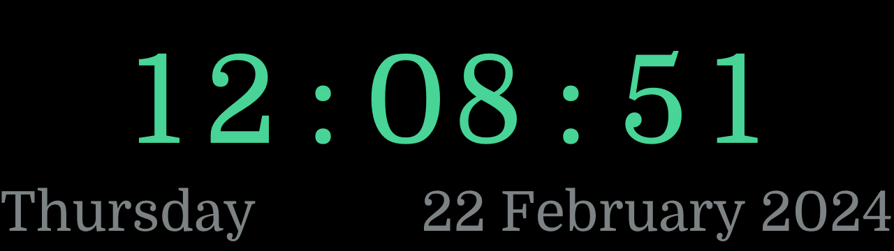

# The Oxide Office Clock

The clock in the Oxide Office displays the local time and date in print
sufficiently large to be visible from most parts of our floor space.  It is a
Rust program that runs on a small computer (presently, a Dell Wyse 3040 thin
client device), booted into a custom
[Helios](https://github.com/oxidecomputer/helios) ramdisk image.

The generated display looks like this:

In the office, it looks like this:

## Operation

On an illumos system, this program will take over the framebuffer device
usually operated by [wscons(4D)](https://illumos.org/man/4D/wscons).  The
mechanism in use is crude, and absolutely no warranty is made about its
use.  You have been warned!

For ease of development, if built on a Linux workstation the clock will be
rendered into a basic X11 window with the same aspect ratio as the target
display in the office.

## License

Fonts embedded in this program are available under the [SIL Open Font License
Version 1.1](./LICENSE-OFL).

Unless otherwise noted, all components are licenced under the [Mozilla Public
License Version 2.0](./LICENSE).
